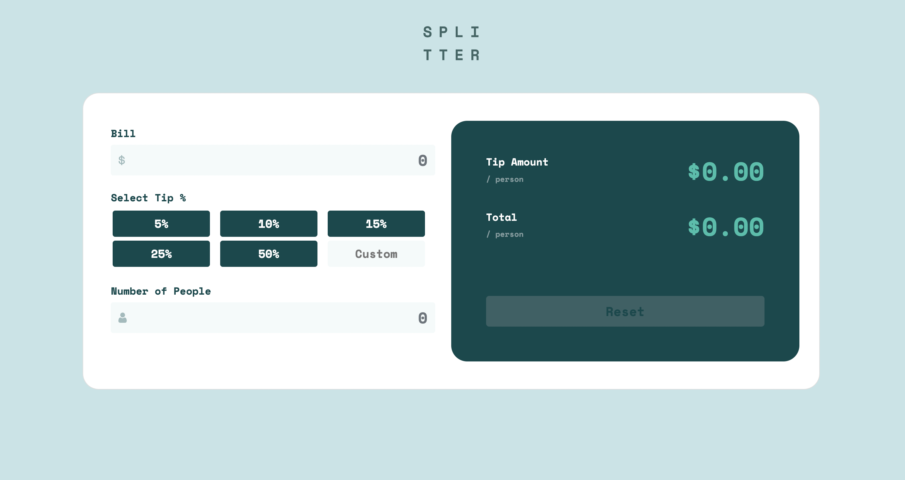

# Frontend Mentor - Tip calculator app solution

This is a solution to the [Tip calculator app challenge on Frontend Mentor](https://www.frontendmentor.io/challenges/tip-calculator-app-ugJNGbJUX). Frontend Mentor challenges help you improve your coding skills by building realistic projects.

## Table of contents

- [Overview](#overview)
  - [The challenge](#the-challenge)
  - [Screenshot](#screenshot)
  - [Links](#links)
- [My process](#my-process)
  - [Built with](#built-with)
  - [What I learned](#what-i-learned)
  - [Continued development](#continued-development)
  - [Useful resources](#useful-resources)
- [Author](#author)

## Overview

### The challenge

Users should be able to:

- View the optimal layout for the app depending on their device's screen size
- See hover states for all interactive elements on the page
- Calculate the correct tip and total cost of the bill per person

### Screenshot

### Links

- Solution URL: [Tip Calculator](https://mollibeth.dev/tip-calculator)

## My process

### Built with

- HTML5 markup
- CSS custom properties
- Bootstrap Grid and Flexbox
- Javascript
- [Bootstrap](https://getbootstrap.com/)

### What I learned

I used this challenge to practice implementing Javascript to create the functionality of the tip calculator, as well as continued practice of CSS to match the design files as closely as possible. I used Bootstrap grid and flexbox to make the site responsive to various viewports.

### Continued development

To improve this site and match the design specs more closely, I'd like to look into how to override different settings of various browsers. For example, when using Chrome and an input field is active, it shows a highlighted border. This is something I found challenging to fix and did not readily find a solution through searching the internet. I'd like to spend more time understanding browser settings so that a site appears uniform across any device or browser used.

### Useful resources

- [Bootstrap Docs](https://getbootstrap.com/docs/5.2/layout/grid/) - Always reference the documentation.

## Author

- Website - [Mollibeth Cardwell](https://www.mollibeth.dev)
